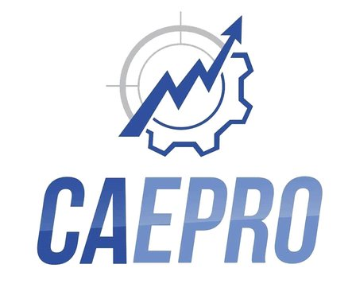

# Introdução ao Manual da CAEPRO

Boas-vindas ao Manual da CAEPRO, digo, futuro Manual da CAEPRO, se você nos ajudar! O que seria isso, afinal? O Manual da CAEPRO é uma das propostas da chapa EVOlução com os seguintes pontos em mente:

* Documentar as principais dúvidas dos calouros e veteranos.
* Ter uma documentação de fácil acesso.
* Revelar os mistérios do SIGAA.
* Revelar alguns processos da UFPI: estágios, monitoria, iniciação científica e etc.
* Apoiar os alunos com recursos externos como links úteis.

Se você está lendo isso online, parabéns, acaba de conhecer a futura plataforma do Manual. 

Pretendemos honrar nossos valores EVO: Estratégia, Visão e Objetivo. E para isso, listamos nossas outras propostas:

* Evoluir e manter os antigos projetos da última gestão da CAEPRO como o "Divulgaê" e a "Semana do Calouro". Afinal, queremos ser a evolução. Além disso, novos projetos surgem com a evolução, leia mais para saber quais.
* Criar um servidor no Discord para uma melhor comunicação e união da comunidade. Receber feedback e solução de dúvidas com texto, vídeo e áudio em tempo real é tudo possível no Discord.
* Trazer o mundo real da engenharia para os alunos com o projeto "Exercitando a Produção". Esse projeto desenvolverá trabalho em equipe, oficinas e palestras relevantes para o curso.
* Três palavras essenciais que não podem faltar: acessibilidade, transparência e comunicação. Pretendemos trazer isso sempre que possível, exemplo disso são as publicações com texto alternativo no Instagram.
* Depois dessa maratona de propostas, lembre-se que acreditamos no valor do esporte como meio de desenvolvimento físico e social. Por isso, tentaremos o possível para fomentar ainda mais o esporte seja físico ou eSports.

Parece incrível, né? Tudo isso só depende de você para se tornar realidade. Vote na chapa EVOlução e traga a evolução para a CAEPRO.
