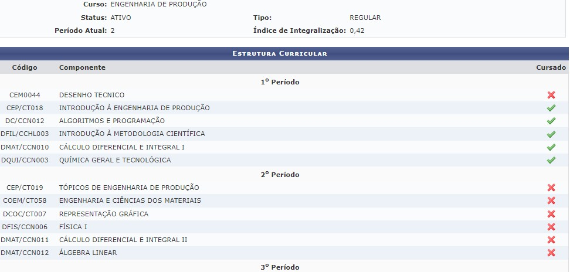

# Descomplicando o SIGAA

## Avaliação Docente

###  O que é a avaliação docente?

É um procedimento realizado pelo Sistema Integrado de Gestão de
Atividades Acadêmicas (SIGAA), no qual os alunos avaliam o desempenho
dos professores do período anterior, com intuito de melhorias para
formação e atendimento à comunidade acadêmica.

### Passo a passo

Passo 1:

Selecione o botão AVALIAÇÃO DOCENTE, situado abaixo de sua e nome.

Outra forma seria pela ferramenta ENSINO \> avaliação docente \>
preencher avaliação docente.

Passo 2: Após seguir o passo 1, irá aparecer uma nova aba, com
perguntas, e logo à frente os códigos da disciplina, onde o aluno será
responsável por avaliar o docente entre notas de 1-5, que dependerá do
desempenho do professor em cada situação.

Passo 3: Após responder a avaliação, finalize enviando suas respostas.

## Ver as Minhas Notas

### Passo a passo

1. Selecione a aba "Ensino"
2. Clique em "Minhas notas"

Após isso, carrega uma página contendo nome, matrícula e curso do aluno, assim como uma grade com as disciplinas de cada período e seus códigos, notas/médias, faltas e situação no final.

Observe que em "Situação", pode-se haver:

* AM - Aprovado por média (média maior ou igual a 7)
* EF - Exame final (média maior ou igual a 4 e menor que 7)
* RN - Reprovado por nota (média menor que 4 ou frequência menor que 75% das aulas)

## Atestado de Matrícula

### O que é?

O Atestado de Matrícula indica os Componentes Curriculares em que o discente se encontra matriculado, informando o horário das atividades.

### Passo a passo

 Existem dois métodos de acesso para o Atestado de Matrícula. No primeiro o discente deve acessar a aba ‘**ensino**’ e clicar na opção '**atestado de matrícula**’. Já no segundo método, ainda dentro da parte de ensino, o estudante deve seguir até a opção ‘**matrícula on-line**’ e nela acessar a opção atestado de matrícula.

Por fim, uma tela como a próxima imagem aparecerá:

## Consultar Histórico

### O que contém no histórico?

O histórico contém dados como:

- Dados Pessoais

- Dados do curso

- Componentes Curriculares Cursados/Cursando

- Atividades Complementares

- Componentes Curriculares Obrigatórios Pendentes

Útil para encontrar o número de matrícula, o período letivo inicial, prazo máximo para conclusão do curso, período letivo atual, índices acadêmicos, atividades de extensão aceitas e etc.

Dados pessoais que podem ser encontrados:

Dados do curso que podem ser encontrados:

### Passo a passo

Passo 01: Selecionar “Ensino” no portal do discente e depois “Consultar Histórico”. Por fim, um arquivo PDF será gerado dessa ação.

## O que é e como Consultar Projeto de Ensino

Entende-se por Projeto de Ensino toda proposta de atividade com vista à melhoria de ensino-aprendizagem. 

### Passo a passo

#### Busca de projetos

1. Na aba "Ensino" clique em "Projeto de Ensino"
2. Clique em "Inscrições" e em seguida "Inscrever-se em Projetos de Ensino" (caso deseje se inscrever em algum Projeto de Ensino).
3. Em seguida você vai ver a lista de projetos com período de inscrições abertas, portanto no quadro “Busca por projetos de ensino” você poderá pesquisar o título do projeto, o tipo de atividade, coordenador e período, em seguida clique em filtrar, após aparecer o projeto que deseja, faça sua inscrição (caso não tenha nenhum projeto de ensino com período de inscrição aberto, tal informação aparecerá em vermelho logo abaixo do quadro “Busca por projeto de ensino”.

#### Gerenciar suas inscrições

1. Na aba "Ensino" clique em "Projeto de Ensino"
2. Clique em "Inscrições" e em seguida "Gerenciar Minhas Inscrições" (caso você já tenha feito sua inscrição e deseja consultá-la).

#### Certificados de Projeto de Ensino

1. Na aba "Ensino" clique em "Projeto de Ensino"
2. Ainda na aba "Projeto de Ensino", clique em "Certificados"

    

3. Clique em Emitir Certificado Participante para ver e emitir o certificado que você fez como participante
 
    

3. Clique em Emitir Certificado Membro, para ver e emitir o certificado que você participou como membro.

    

## Declaração de Vínculo

### O que é a declaração de vínculo?

Serve como um documento para provar que o discente está vinculado e
ativo em sua graduação. Este registro, contém algumas informações, por
exemplo, nome completo, número da matrícula e o curso do graduando.

### Passo a passo

Passo 01: Selecionar a ferramenta ENSINO \> declaração de vínculo. Logo,
será gerado um PDF com a declaração.

## Encontrar Carga Horária Cursada

### Passo a passo

1. Selecione a aba "Ensino"
2. Selecione a opção "Certidões"
3. Clique em "Carga Horária Cursada"

Após isso, um documento PDF contendo os dados do aluno, curso e carga horária cursada pelo aluno (número de horas do total).

## Matrícula online

### O que é?

A Matrícula on-line é a ferramenta a qual o aluno deve recorrer para se inscrever nas disciplinas do período seguinte. Normalmente ela fica disponível alguns dias antes do início do período letivo.

### Passo a passo

Para acessar a matrícula on-line o aluno deve ir na aba '**Ensino**' do menu do discente e acessar a opção ‘**Matrícula On-line**’. Por ele, além de realizar a matricula, você pode acompanhar a situação da mesma e obter o seu atestado de matrícula.

### Tipos de matrícula

#### Matrícula Institucional

A **matrícula institucional** é a que deve ser realizada pelo discente antes de todo período.

##### Como acessar

Caso não esteja em período de matrícula institucional:

1. É feita a escolha das matérias no quais serão feitas no período, se o aluno for do primeiro semestre irá já pré escolhido as matérias sinalizadas por uma faixa verde. Logo após a escolha é só confirmar no final da página.

    

2. Logo após a escolha virá uma página com as matérias escolhidas e um horário com elas, se tudo estiver de acordo é só confirmar a matricula. 

Caso queira, é possível imprimir a solicitação de matrícula após a confirmação:

**Obs:** Se por acaso não tiver a matéria desejada o aluno pode ver quais são as matérias equivalentes para a desejada, ou seja, o aluno pode conseguir pegar a matéria em outra turma. É só ir no relatório de diagnóstico de matrícula.

Na aba equivalência aparece o código da matéria equivalente, basta apenas o aluno voltar na parte de matrícula institucional e conferir se o código da matéria equivalente é correspondente.

 

Dica: se o aluno precisar ou quiser conferir o seu comprovante de matrícula ou saber como está a situação, ele fica disponível logo após a validação da matricula institucional. Basta selecionar '**ver comprovante de matrícula**'

Situação deferida indica matrícula aprovada, já situação indeferida é o mesmo que matéria não aprovada.

#### Matrícula Extraordinária

**A matrícula extraordinária** é aquela realizada em turmas extras após o período das matrículas institucionais.

##### Como acessar

O processo de matricula é o **mesmo da institucional**, a diferença é só a data em que ela pode ser realizada.

#### Matrícula em turmas de férias

Existem ainda as **matrículas em turmas de férias** que ocorrem somente nos períodos extras durante as férias dos discentes.

##### Como acessar

Basta selecionar '**realizar matricula em turma de férias**'.

O processo de matricula é o **mesmo da institucional**, a diferença é só a data no qual ela pode ser realizada que geralmente é em **20XX.3**

### Situação das matérias selecionadas

Para saber como está a **situação das matérias selecionadas**, basta ir em **‘Ver Orientações de Matrícula’**.

O que retorna:

Para saber a **situação final** antes do inicio das aulas basta ir em ‘**Meu Plano de Matrículas**’

Para saber o resultado final é só selecionar a aba '**Ver Resultado de Processamento**'.

### Atestado de Matrícula

Para consulta do atestado de matrícula (prova de que o aluno está matriculado no período).

#### Passo a passo

Basta selecionar '**atestado de matrícula**'.

O que retorna:

### Relatório de Integralização de Currículo

 Por fim, para saber quais **matérias ainda faltam para concluir o curso** e para saber quais já foram cursadas é só ir na aba abaixo.

O que retorna a seguinte tela:

## Trancamento de Componente Curricular

Nesta operação você irá solicitar o trancamento nas matrículas que desejar. Ao selecionar para trancamento uma disciplina que possui co-requisitos, estes serão trancados automaticamente. Selecione as disciplinas que deseja trancar e informe o motivo, e, caso o motivo não esteja listado, entre com uma justificativa textual.

### Condições

### Passo a passo

Para Trancar Componentes Curriculares, o discente deve entrar no SIGAA → Portal Discente → Ensino → Trancamento de Componente Curricular → Trancar.

Você deve selecionar a disciplina que deseja trancar, marcar e apertar em solicitar trancamento.

A tela seguinte exibirá as informações das disciplinas com trancamento solicitado e a confirmação dos dados pessoais. Aperte em **confirmar a solicitação.** Por fim, o sistema mostrará o sucesso da operação, juntamente com os dados da solicitação do trancamento.

## O que é e como fazer o Trancamento de Curso

De acordo com  a  norma 177/2012  do  funcionamento dos cursos de graduação da  UFPI, o trancamento de curso é a suspensão oficial das atividades acadêmicas do aluno, garantindo a manutenção do vínculo ao curso de graduação.

### Passo a passo

Ela é realizada pelo próprio aluno da instituição em três fases:
 
1. O aluno solicita o trancamento de curso on-line pelo próprio SIGAA. Basta seguir, Portal do Discente → Ensino → Trancamento de Curso → Iniciar Solicitação de Trancamento.
2. O  aluno se  direciona ao  DAA  para  entregar o  pedido de  trancamento emitido  pelo SIGAA.
3. O DAA defere ou indefere o pedido do aluno via SIGAA.

Logo abaixo são mostrados os passos que devem ser seguidos para a realização do procedimento de trancamento de curso.

1. O aluno se loga no Portal do Discente.

    

2. O aluno seleciona “Iniciar solicitação de trancamento”. Para isso, Ensino → Trancamento de Curso → Iniciar Solicitação de Trancamento.

    

3. O aluno será informado sobre as regras de trancamento de curso.

    

4. O aluno deverá aceitar os termos e imprimir o termo de trancamento de curso.
5. Apenas o próprio aluno pode realizar o pedido de trancamento de curso. Para isso, é necessário informar a data de nascimento e senha do aluno.

    

6. Caso todos os dados estejam de acordo, o aluno deverá imprimir o comprovante de solicitação de trancamento de curso.

    

7. Será impressa a solicitação de trancamento de curso. É importante lembrar que o aluno deverá assinar o comprovante gerado e enviar ao setor indicado nas instruções listadas no mesmo.

Fonte para Trancamento De Curso: <https://ufpi.br/manuais-da-sti/videos-e-manuais-do-sigaa/category/16-alunos>

## Consultar Curso

### O que é a ferramenta consultar curso?

É uma aba do SIGAA, que serve para informar sobre os cursos ofertados
pela universidade.

### Passo a passo

Passo 01: Selecionar a ferramenta ENSINO \> consultar curso.

## Consultar Componente Curricular

1. Selecione a aba "Ensino"
2. Clique em "Consultar Componente Curricular"

Funciona como um filtro para auxiliar na busca por componentes curriculares, em que diversos aspectos são levados em consideração, sendo os mais gerais o nível, unidade responsável e tipo do componente, que são selecionáveis pelo usuário. O resultado da consulta também pode ser exibido em formato de relatório ao marcar a opção.

Seleção do nível:

Seleção da unidade responsável:

Seleção do tipo de componente:

A seguir, um exemplo de consulta:

Caso marque a opção "Exibir resultado da consulta em formato de relatório" ao buscar:

## Consultar Estrutura Curricular

### O que é?

Nessa opção fica disponível para consulta a Estrutura Curricular.

### Como acessar

O discente deve ir até a aba '**ensino**' e no fim da aba deve acessar a opção '**Consultar Estrutura Curricular**’.

Para conseguir uma declaração de período máximo para concluir o curso é só clicar no símbolo de copia na frente da matriz curricular desejada:

## O que é e como Consultar Calendário Acadêmico

Sistema de divisão do tempo que considera o ano letivo e estabelece os períodos de aula, de recesso e outras identificações julgadas conveniente, tendo em vista o interesse do processo educacional e o disposto no projeto pedagógico.

### Passo a passo

1. Na aba "Ensino" clique “consultar calendário acadêmico”

    

2. Assim, você terá acesso a todos os calendários acadêmicos

    

3. Clicando no ícone de pesquisa você terá acesso ao calendário acadêmico escolhido

    
    
